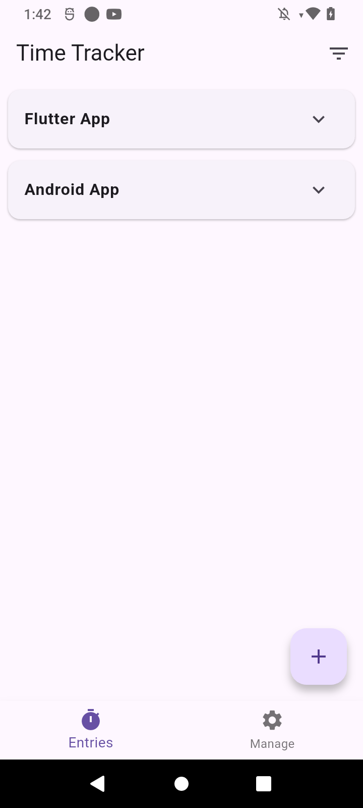
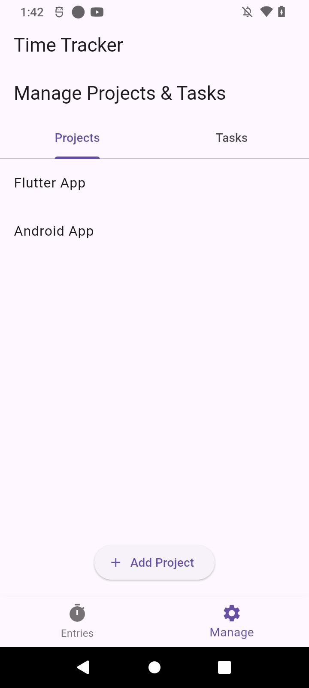
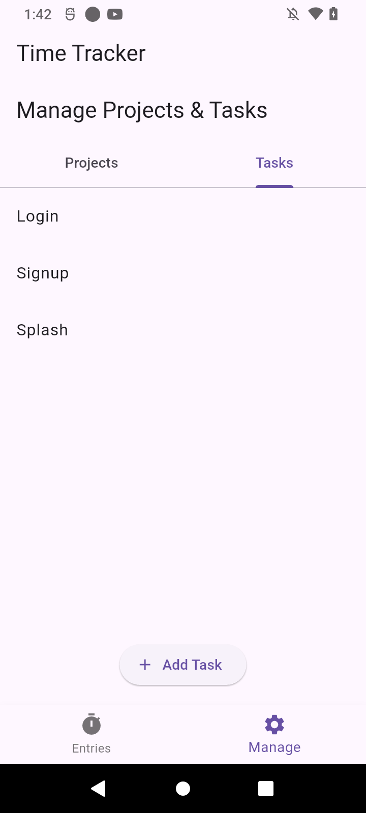

# ⏱️ Time Tracker App (Flutter)

A simple **Time Tracker app** built using **Flutter** and **Provider** for state management.  
The app allows users to track time spent on different tasks/projects with project and task management.

---

## ✨ Features
- 🕒 Manage Projects and Tasks
- 🔄 Manage ongoing tasks with **Provider state management**
- 💾 Local storage support (Localstorage / SharedPreferences)
- 🎨 Clean and responsive UI for Android & iOS

---

## 🛠️ Tech Stack
- **Framework:** Flutter
- **State Management:** Provider
- **Local Storage:** Localstorage / SharedPreferences
- **Language:** Dart
- **IDE:** Android Studio / VS Code

---


## 🚀 Getting Started

### Prerequisites
- Install [Flutter SDK](https://flutter.dev/docs/get-started/install)
- Setup [Android Studio](https://developer.android.com/studio) or VS Code

### Installation
1. Clone this repository:
   ```bash
   git clone https://github.com/tripathivivek98/time_tracker.git

2. Navigate to the project folder:
    ```bash
    cd time_tracker

3. Install dependencies:
    ```bash
    flutter pub get

4. Run the app:
    ```bash
   flutter run


## 📂 Folder Structure

  ```bash
  lib/
  ├── main.dart          # App entry point
  ├── screens/           # UI screens
  │   └── add_time_entry_screen.dart
  │   └── home_screen.dart
  │   └── project_task_management_screen.dart
  ├── models/            # Data models
  │   └── project.dart
  │   └── task.dart
  │   └── time_entry.dart
  ├── providers/         # State management providers
  │   └── project_task_provider.dart
  │   └── time_entry_provider.dart
  └── widgets/           # widgets 
      └── entry_tile.dart
  
  ```

## 📱 Screenshots
<p align="center">
  
  
  
  
</p>

---

## 📜 License

This project is licensed under the MIT License – see the [LICENSE](LICENSE) file for details.


## 🤝 Contributing
Contributions are welcome!<br>
Feel free to fork this repo, raise issues, and submit PRs.


👤 Author : Vivek Tripathi

💼 [LinkedIn](https://www.linkedin.com/in/vivek--tripathi/)

🐙 [GitHub](https://github.com/tripathivivek98)

